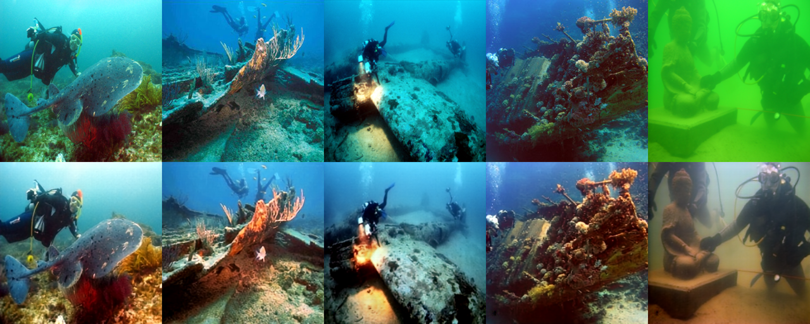
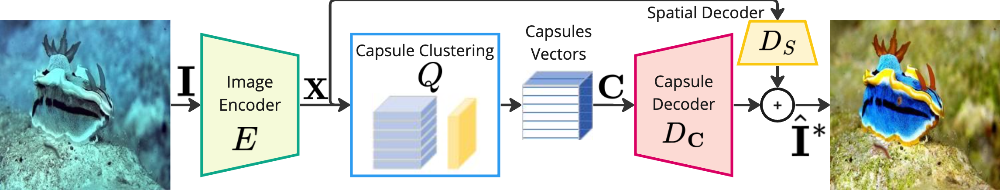

# CE-VAE: Capsule Enhanced Variational AutoEncoder for Underwater Image Enhancement



This repository contains the code accompanying the scientific paper "Capsule Enhanced Variational AutoEncoder for
Underwater Image Enhancement" by Rita Pucci and Niki Martinel. The paper is available on [arXiv](https://arxiv.org/abs/2406.01294).

## Description

Unmanned underwater image analysis for marine monitoring faces two key challenges: (i) degraded image quality due to light attenuation and (ii) hardware storage constraints limiting high-resolution image collection.
Existing methods primarily address image enhancement with approaches that hinge on storing the full-size input.

In contrast, we introduce the Capsule Enhanced Variational AutoEncoder (CE-VAE), a novel architecture designed to efficiently compress and enhance degraded underwater images. Our attention-aware image encoder can project the input image onto a latent space representation while being able to run online on a remote device. The only information that needs to be stored on the device or sent to a beacon is a compressed representation. There is a dual-decoder module that performs offline, full-size enhanced image generation. One branch reconstructs spatial details from the compressed latent space, while the second branch utilizes a capsule-clustering layer to capture entity-level structures and complex spatial relationships. This parallel decoding strategy enables the model to balance fine-detail preservation with context-aware enhancements.

CE-VAE achieves state-of-the-art performance in underwater image enhancement on six benchmark datasets, providing up to $3\times$ higher compression efficiency than existing approaches.

## TL;DR;



## Installation

To set up the environment and install the required packages, follow these steps:

1. Create a virtual environment:
   ```sh
   conda create -n cevae python=3.11
   conda activate cevae
   ```

2. Install PyTorch (v.2.2) and other relevant dependencies:
   ```sh
   conda install pytorch==2.2.0 torchvision==0.17.0 pytorch-cuda=12.1 -c pytorch -c nvidia
   pip install -r requirements.txt
   ```

## Usage

### Training

To train the model, run:

```sh
python main.py --config [path of config]
```

#### LSUI training config example

Examples of config files can be found in the `configs` folder.
To train our model with the default configuration on the LSUI dataset, follow these steps:
1. Generate the txt training and validation files for the LSUI dataset. Assuming your local system has the following structure 
   ```
   /home/user/data/LSUI
   ├── train
   │   ├── GT
   │   └── input
   └── val
       ├── GT
       └── input
   ```
   you should first run:
      ```sh
      bash scripts/generate_dataset_txt.sh /home/user/data/LSUI/ 
      ```
   to generate the training and validation paired input text files `(LSUI_train_input.txt, LSUI_train_target.txt)` and `(LSUI_val_input.txt, LSUI_val_target.txt)`.    
   These are the "default" files that we have in the LSUI training configs `./configs/cevae_*_lsui.yaml`

3. Train the CE-VAE model without the
discriminator.
   Start by downloading the ImageNet-pretrained model from [here](https://uniudamce-my.sharepoint.com/:u:/g/personal/niki_martinel_uniud_it/ESe3q_vE9EtJur7Ioda8UMoBS-P8jCZdlXbLO3gp-XUKQg?e=RBpa8x) and save it into the `data` folder. 
   Then execute
   ```sh
   python main.py --config configs/cevae_E2E_lsui.yaml
   ```
   **Training logs, containing checkpoints, and samples of generated images are in `./training_logs`**

4. Once you have the checkpoints for the model trained without the discriminator, you can need to edit the `ckpt_path` entry in the `configs/cevae_GAN_lsui.yaml` to point it to your local pth file and then run the following command to finetune the model with the discriminator:
   ```sh
   python main.py --config configs/cevae_GAN_lsui.yaml
   ```

### Underwater Image Enhancement

To evaluate the model on a folder, run:
```sh
python test.py --config [path of config] --checkpoint [path of checkpoint] --data-path [folder path containing images to enhance] --output-path [path of output folder where enhanced images will be saved]
```

If you do not want to train, [here](https://uniudamce-my.sharepoint.com/:u:/g/personal/niki_martinel_uniud_it/ERyTb1QQvARBuU6GL_-M2egBlndUS6Xi0LLPxEP2AI8qxg?e=RMQMQu) you can download the LSUI pre-trained model checkpoint. So just replace [path of checkpoint] with the path of the downloaded file, then run using the LSUI config. 


## Results

### Quantitative comparison of the LSUI-L400 dataset

| Method                                               | PSNR ↑    | SSIM ↑   | LPIPS ↓  |
|------------------------------------------------------|-----------|----------|----------|
| RGHS                           | 18.44     | 0.80     | 0.31     |
| UDCP                            | 13.24     | 0.56     | 0.39     |
| UIBLA                          | 17.75     | 0.72     | 0.36     |
| UGAN                      | 19.40     | 0.77     | 0.37     |
| Cluie-Net                      | 18.71     | 0.78     | 0.33     |
| TWIN                           | 19.84     | 0.79     | 0.33     |
| UShape-Transformer | 23.02     | 0.82     | 0.29     |
| Spectroformer         | 20.09     | 0.79     | 0.32     |
| **CE-VAE (Our Method)**                              | **24.49** | **0.84** | **0.26** |

### Qualitative comparison of the LSUI-L400 dataset


## License

This project is licensed under the terms specified in the `license.txt` file.

## Citation

If you find this code useful or use it in your research, please cite our paper! Thx :)

```bibtex
@article{pucci2024capsule,
      title={CE-VAE: Capsule Enhanced Variational AutoEncoder for Underwater Image Reconstruction}, 
      author={Rita Pucci and Niki Martinel},
      year={2024},
      month={Feb},
      booktitle={IEEE/CVF Winter Conference on Applications of Computer Vision (WACV)},
}
```

